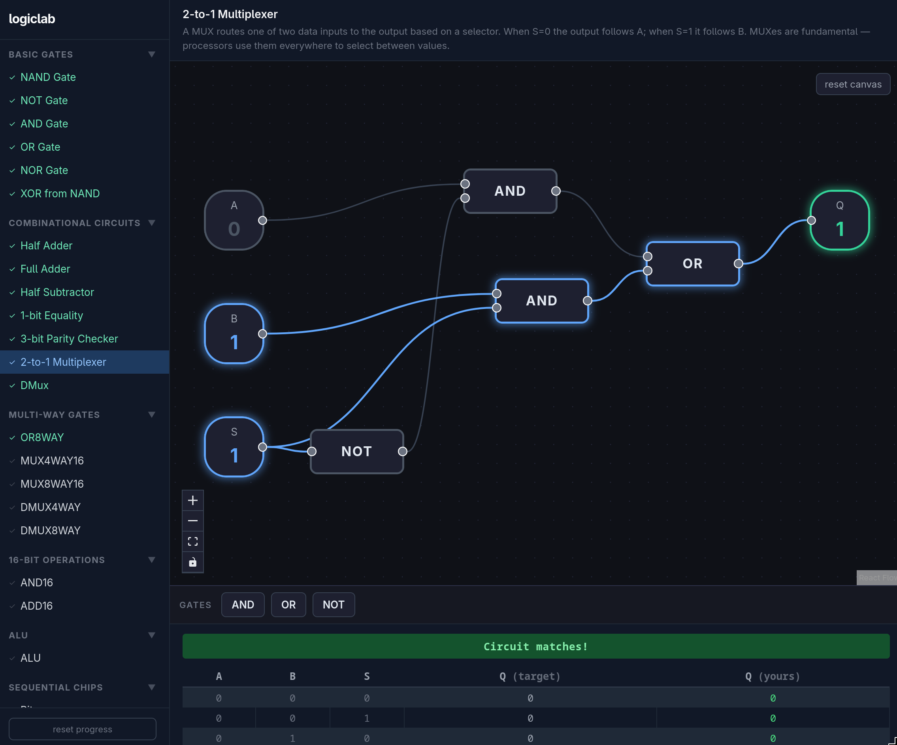

# LogicLab

A browser-based logic circuit simulator and learning tool. Build logic gates and chips from scratch — starting from NAND and working your way up to an ALU and sequential memory.

Inspired by [nand2tetris](https://www.nand2tetris.org/).



## What it is

LogicLab presents a series of challenges where you wire up logic gates on a canvas to match a target truth table. Each completed challenge unlocks new gate types, building a tech tree from fundamental primitives up through complex chips.

**Challenge progression:**

1. **Basic Gates** — Build NOT, AND, OR, NAND, NOR, XOR, XNOR from NAND
2. **Combinational** — Half adder, full adder, subtractor, comparator, MUX, DMUX, parity checker
3. **16-bit** — AND16, OR16, ADD16 (auto-unlocked when scalar counterparts are mastered)
4. **Multi-way** — OR8WAY, MUX4WAY16, MUX8WAY16, DMUX4WAY, DMUX8WAY
5. **ALU** — Full Hack ALU with zx/nx/zy/ny/f/no control bits, out/zr/ng outputs
6. **Sequential** — DFF, Bit, Register, RAM8 → RAM16K, Program Counter

Completing a challenge unlocks it as a reusable component in subsequent challenges.

## Features

- **Visual canvas** — drag, drop, and connect gates using React Flow
- **Live verification** — circuit is evaluated on every change against the target truth table
- **Truth table panel** — shows expected vs actual outputs with pass/fail per row
- **Sequential tests** — tick-based test sequences for DFF and memory chips
- **Bus support** — 16-bit bus inputs/outputs with hex editing
- **Tech tree** — gates unlock progressively; completed circuits become reusable chips
- **Reset canvas** — clear the editor without losing challenge progress
- **Reset all progress** — wipe everything and start over

## Getting started

```bash
npm install
npm run dev
```

Open [http://localhost:5173](http://localhost:5173).

```bash
npm run build    # production build
npm run preview  # preview production build
```

## Project structure

```
src/
  engine/         # Pure simulation logic (no React)
    types.ts      # Circuit, Gate, Connection, etc.
    gates.ts      # Gate evaluation functions
    simulate.ts   # Topological sort, circuit evaluation, truth table generation
    builtins.ts   # Pre-compiled composite gate definitions (OR8WAY, ALU, RAM...)
  content/
    challenges.ts # All challenge definitions with reference circuits
    types.ts      # Challenge, Section, SeqTestStep types
  components/
    Editor.tsx              # React Flow canvas + node wiring logic
    GateNode.tsx            # Primitive gate node renderer
    CompositeGateNode.tsx   # User-built / builtin chip node renderer
    InputNode.tsx / OutputNode.tsx          # Scalar I/O nodes
    BusInputNode.tsx / BusOutputNode.tsx    # 16-bit bus I/O nodes
    Palette.tsx             # Gate palette sidebar
    TruthTablePanel.tsx     # Combinational truth table display
    SeqTestPanel.tsx        # Sequential test step display
  App.tsx         # Top-level state, challenge selection, unlock logic
```

## How the engine works

The simulation engine is pure TypeScript with no React dependencies.

- Circuits are a flat list of `Gate` objects and `Connection` objects
- `evaluateCircuit` runs Kahn's topological sort, then evaluates gates in order
- DFF gates are treated like INPUT gates during topo sort — their output is the stored state from the previous clock cycle
- Composite gates (user-built or builtins) are flattened into the circuit before evaluation via `flattenCircuit`
- Truth tables are generated by iterating all 2^n input combinations
- Sequential challenges use `SeqTestStep` sequences with optional `tick` steps that advance DFF state
